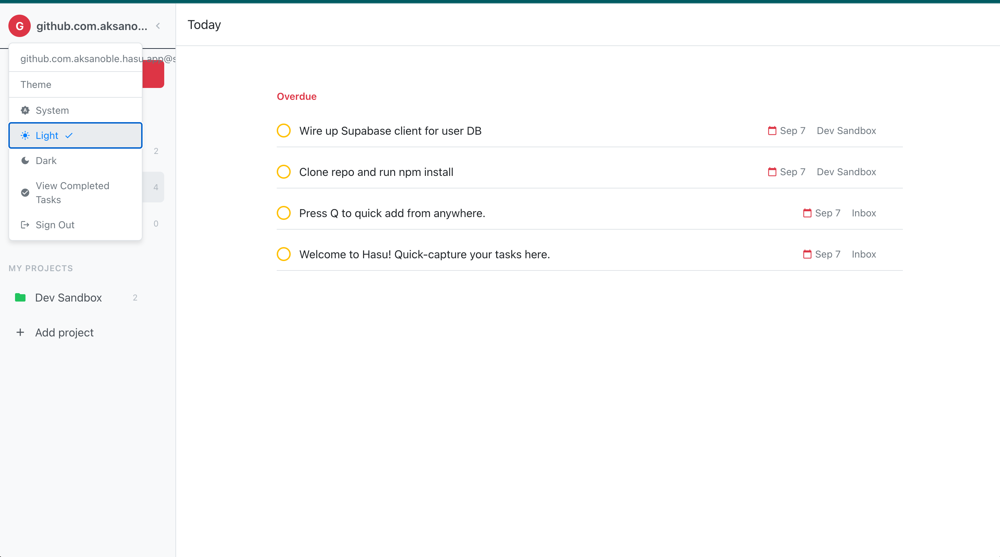
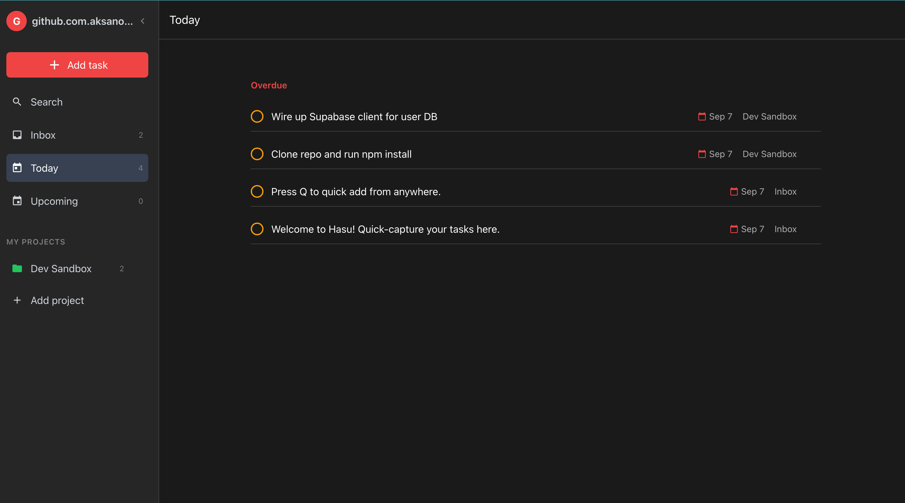
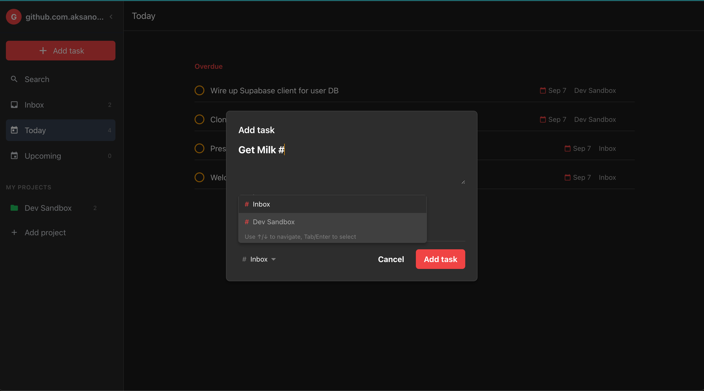
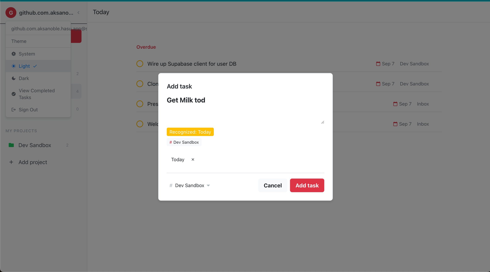
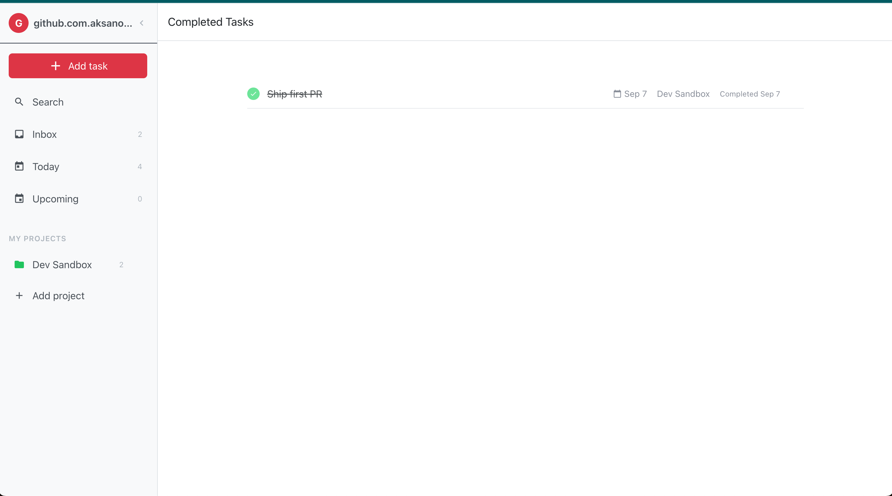

# Hasu — A Todoist clone that works with your Supabase.

Hasu is a simple, fast todo app that runs entirely on your own Supabase project. It uses Supakey for authentication and one‑click setup so your data stays private and under your control.

Status: Alpha — looking for early testers. Expect breaking changes and report issues generously.

## Screenshots

Below are a few screens of Hasu.

  
  
<em>Today View</em>

  

  
  
<em>Dark theme</em>

  

  
  
<em>Create Projects</em>

  

  
  
<em>Quick Add Task</em>

  

  
  
<em>Completed Tasks</em>

  

**What This Means**

- Your data lives in your Supabase project (not ours).
- Hasu never needs your service keys in the browser; it uses short‑lived user JWTs issued via Supakey.
- Row‑Level Security is enforced on your tables.

**How It Works**

- Login with Supakey → approve Hasu.
- Supakey deploys Hasu’s schema to your Supabase (per‑app schema derived from `REACT_APP_HASU_APP_IDENTIFIER`).
- Supakey issues app‑specific user tokens (JWT + refresh).
- Hasu connects directly to your Supabase using those tokens and works entirely client‑side.

## Features

- Projects: Inbox auto‑created, favorites, and regular projects.
- Todos: quick add, due dates, complete/uncomplete, project assignment.
- Smart views: Today, Upcoming, Completed.
- Realtime updates: live counts and task changes.
- Search: Cmd/Ctrl+K to search and toggle tasks from results.
- Quick Add window: lightweight add flow (`?mode=quick-add`) and “q” to open add modal in app.
- Sample data: first run seeds Inbox and a “Dev Sandbox” project so you can explore quickly.

## Prerequisites

- A Supabase project for your data (user’s database).
- A Supakey account for auth and setup.

## Setup & Development

See `hasu/CONTRIBUTING.md` for environment variables and local development steps.

## What Supakey Does (Once)

- Creates a dedicated schema in your Supabase for Hasu (derived from `REACT_APP_HASU_APP_IDENTIFIER`).
- Applies RLS and grants for authenticated users (no anon access).
- Issues app‑specific user tokens so Hasu can connect directly to your database.

## Alpha Disclaimer

- APIs and schema may change.
- Expect occasional rough edges; please open issues/PRs.

## CONTRIBUTING

See `hasu/CONTRIBUTING.md`.

## License

- Apache-2.0 — see `LICENSE` in this directory.
